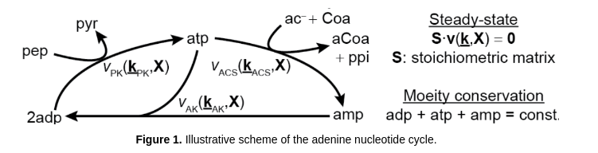
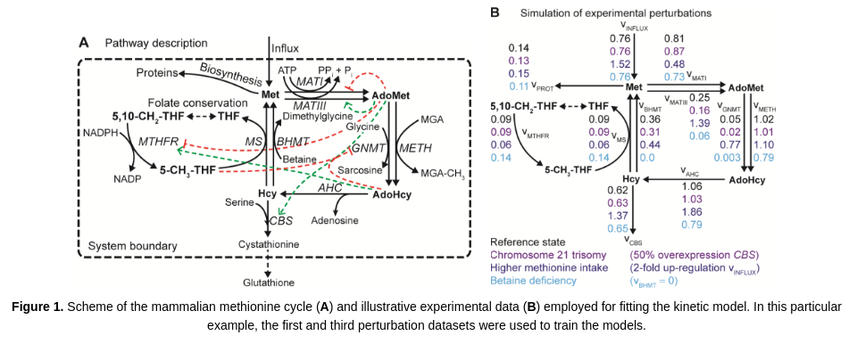
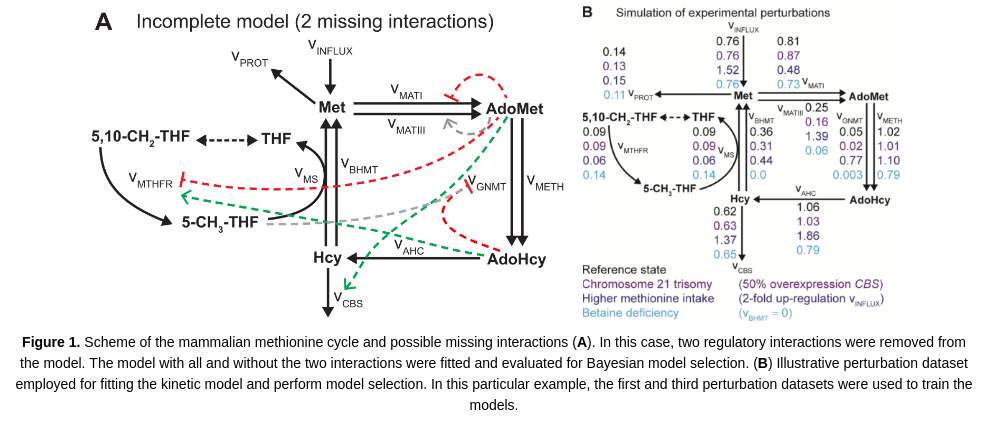

Tutorials
=================

You can find five tutorials, for different use cases, in the folder `tutorials`, as well as some examples in the `examples` folder. It might be faster to run the code in the tutorials in a simple matlab script.

Tutorial 1
-----------------------

The aim of this tutorial is to illustrate the execution and use of GRASP for building and analyzing kinetic models of metabolism. This tutorial demonstrates how to sample around a thermodynamically feasible (random) reference state and perform MCA in a simple model of the adenine nucleotide cycle (Valero et al. 2006). This model contains 3 reactions, 3 balanced metabolites and 6 external metabolites (not balanced). Also, this model has 1 moeity conservation relation.

Sampling from the prior (GRASP mode)
~~~~~~~~~~~~~~~~~~~~~~~~~~~~~~~~~~~~~~~~~~

Clear all variables and add functions to path. Note that you need to be in the tutorials folder.

.. code-block:: matlab

    clear, close all
    rng('default');                 % for reproducibility
    addpath(fullfile('..', 'matlab_code', 'analysisFxns'), ...
            fullfile('..', 'matlab_code', 'ensembleFxns'), ...
            fullfile('..', 'matlab_code', 'patternFxns'));

Set the maximum number of models to sample. This is particularly important when simulating the model from the prior (i.e., no experimental data defined)

.. code-block:: matlab

    maxNumberOfSamples = 1e5;

Set a threshold for the minimum Jacobian eigenvalue of the system. Models with values below this threshold will be discarded due to unstability criteria.

.. code-block:: matlab

    eigThreshold = 1e-5;

Define the model ID name, input and output files. These paths are necessary for executing GRASP.

.. code-block:: matlab

    modelID = 'tutorial_01_adenine_cycle';
    inputFile  = fullfile('..', 'io', 'input', modelID);
    outputFile = fullfile('..', 'io', 'output', [modelID, '.mat']);

Build the kinetic ensemble. In this case, we will build an ensemble of 100 models. To accelerate computations, we set the parellel mode to 'on' in the specification file. Two cores will be assigned to these calculations, although more can be assigned if desired.

.. code-block:: matlab

    tic
    ensemble = buildEnsemble(inputFile, outputFile, maxNumberOfSamples, eigThreshold);
    toc

Using this ensemble, we compute flux and metabolite control coefficients and visualize the final results

.. code-block:: matlab

    mcaResults = controlAnalysis(ensemble,1);
    categories = {};         % Displays MCA results for all the reactions
    plotControlAnalysis(mcaResults, ensemble, categories);

References
~~~~~~~~~~~~~~~~~~~~~~~~~~~~~~~~~~~~~~~~~~
1. Valero E, Varón R, García-Carmona F. (2006) A kinetic study of a ternary cycle between adenine nucleotides. The FEBS Journal 273: 3598–3613

Tutorial 2
-----------------------

The aim of this tutorial is to illustrate the execution and use of GRASP for building and analyzing kinetic models of metabolism. This tutorial demonstrates how to build an ensemble of models consistent with experimental data. A simple model of the adenine nucleotide cycle (Valero et al. 2006) is employed for illustrative purposes. This model contains 3 reactions, 3 balanced metabolites and 6 external metabolites (not balanced). Also, this model has 1 moeity conservation relation.

Building an ensemble of models consistent with experimental data (rejection mode)
~~~~~~~~~~~~~~~~~~~~~~~~~~~~~~~~~~~~~~~~~~~~~~~~~~~~~~~~~~~~~~~~~~~~~~~~~~~~~~~~~~~

Clear all variables and add functions to path. Note that you need to be in the tutorials folder.

.. code-block:: matlab

    clear, close all
    rng('default');                 % for reproducibility
    addpath(fullfile('..', 'matlab_code', 'analysisFxns'), ...
            fullfile('..', 'matlab_code', 'ensembleFxns'), ...
            fullfile('..', 'matlab_code', 'patternFxns'));

Set the maximum number of models to sample. This is particularly important when simulating the model from the prior (i.e., no experimental data defined)

.. code-block:: matlab

    maxNumberOfSamples = 1e5;

Set a threshold for the minimum Jacobian eigenvalue of the system. Models with values below this threshold will be discarded due to unstability criteria.

.. code-block:: matlab

    eigThreshold = 1e-5;

Define the model ID name, input and output files. These paths are necessary for executing GRASP.

.. code-block:: matlab

    modelID = 'tutorial_02_adenine_cycle';
    inputFile  = fullfile('..', 'io', 'input', modelID);
    outputFile = fullfile('..', 'io', 'output', [modelID, '.mat']);

Build the kinetic ensemble. In this case, we will build an ensemble of 12 models. These models will have a max. flux discrepancy of 30% (0.3 in the specification sheet) for all the experimental conditions. Here, the experimental data corresponds to flux and metabolite pool data for five different conditions. It is important to note that, as in the case of single metabolite and enzyme concentration data, pool data must be normalized using the reference state data. The metabolite pool data is given by:

.. math::

    adp_i + adp_i + adp_i = totalPool_i,

where i = {1,...,5} represent exp. conditions (all these concentrations are normalized by the reference state concentrations)

To accelerate the execution of the sampler, we will use the parallel mode with 4 cores assigned.

.. code-block:: matlab

    tic
    ensemble = buildEnsemble(inputFile, outputFile, maxNumberOfSamples, eigThreshold);
    toc

Using this ensemble, we compute flux and metabolite control coefficients and visualize the final results for all the conditions (reference + five experimental conditions)

.. code-block:: matlab

    mcaResults = controlAnalysis(ensemble,1);
    categories = {};         % Displays MCA results for all the reactions
    plotControlAnalysis(mcaResults, ensemble, categories);

References
~~~~~~~~~~~~~~~~~~~~~~~~~~~~~~~~~~~~~~~~~~
1. Valero E, Varón R, García-Carmona F. (2006) A kinetic study of a ternary cycle between adenine nucleotides. The FEBS Journal 273: 3598–3613

Tutorial 3
-----------------------

The aim of this tutorial is to illustrate the execution and use of GRASP for building and analyzing kinetic models of metabolism. This tutorial demonstrates how to build an ensemble of models consistent with experimental data. A kinetic model of the mammalian methionine cycle is used for illustration purposes (Saa and Nielsen, 2016). 

Building an ensemble of models consistent with experimental data (rejection mode)
~~~~~~~~~~~~~~~~~~~~~~~~~~~~~~~~~~~~~~~~~~~~~~~~~~~~~~~~~~~~~~~~~~~~~~~~~~~~~~~~~~~~~~~~~~~~~~~~

Clear all variables and add functions to path. Note that you need to be in the tutorials folder.

.. code-block:: matlab

    clear, close all
    rng('default');                 % for reproducibility
    addpath(fullfile('..', 'matlab_code', 'analysisFxns'), ...
            fullfile('..', 'matlab_code', 'ensembleFxns'), ...
            fullfile('..', 'matlab_code', 'patternFxns'));

Set the maximum number of models to sample. This is particularly important when simulating the model from the prior (i.e., no experimental data defined)

.. code-block:: matlab

    maxNumberOfSamples = 1e5;

Set a threshold for the minimum Jacobian eigenvalue of the system. Models with values below this threshold will be discarded due to unstability criteria.

.. code-block:: matlab

    eigThreshold = 1e-5;

Define the model ID name, input and output files. These paths are necessary for executing GRASP.

.. code-block:: matlab

    modelID = 'tutorial_03_methionine_cycle';
    inputFile  = fullfile('..', 'io', 'input', modelID);
    outputFile = fullfile('..', 'io', 'output', [modelID, '.mat']);

Build the kinetic ensemble. In this case, we will build an ensemble of 12 models. These models will have a max. flux discrepancy of 40% (0.4 in the specification sheet) for the experimental conditions. To accelerate the execution of the sampler, we will use the parallel mode with 2 cores assigned.

.. code-block:: matlab

    tic
    ensemble = buildEnsemble(inputFile, outputFile, maxNumberOfSamples, eigThreshold);
    toc

Using this ensemble, we compute flux and metabolite control coefficients and visualize the final results for all the conditions (reference + five experimental conditions)

.. code-block:: matlab

    mcaResults = controlAnalysis(ensemble,1);
    categories = {};         % Displays MCA results for all the reactions
    plotControlAnalysis(mcaResults, ensemble, categories);

References
~~~~~~~~~~~~~~~~~~~~~~~~~~~~~~~~~~~~~~~~~~
1. Saa PA, Nielsen LK (2016). Construction of feasible and accurate kinetic models of metabolism: A Bayesian approach. Scientific Reports 6: 29635.

Tutorial 4
-----------------------

The aim of this tutorial is to illustrate the execution and use of GRASP for building and analyzing kinetic models of metabolism. This tutorial demonstrates how to build an ensemble of models consistent with experimental data. A kinetic model of the mammalian methionine cycle is used for illustration purposes (Saa and Nielsen, 2016). 

Model selection and fitting of kinetic models consistent with experimental data (rejection mode)
~~~~~~~~~~~~~~~~~~~~~~~~~~~~~~~~~~~~~~~~~~~~~~~~~~~~~~~~~~~~~~~~~~~~~~~~~~~~~~~~~~~~~~~~~~~~~~~~~~

Clear all variables and add functions to path. Note that you need to be in the tutorials folder.

.. code-block:: matlab

    clear, close all
    rng('default');                 % for reproducibility
    addpath(fullfile('..', 'matlab_code', 'analysisFxns'), ...
            fullfile('..', 'matlab_code', 'ensembleFxns'), ...
            fullfile('..', 'matlab_code', 'patternFxns'));

Set the maximum number of models to sample. This is particularly important when simulating the model from the prior (i.e., no experimental data defined)

.. code-block:: matlab

    maxNumberOfSamples = 1e5;

Set a threshold for the minimum Jacobian eigenvalue of the system. Models with values below this threshold will be discarded due to unstability criteria.

.. code-block:: matlab

    eigThreshold = 1e-5;

Define the model ID name, input and output files. These paths are necessary for executing GRASP.

.. code-block:: matlab

    modelID = 'tutorial_04_methionine_cycle';
    inputFile  = fullfile('..', 'io', 'input', modelID);
    outputFile = fullfile('..', 'io', 'output', [modelID, '.mat']);

Build the kinetic ensemble. In this case, we will build an ensemble of 16 models. These models will have a max. flux discrepancy of 40% (0.4 in the specification sheet) for the experimental conditions. To accelerate the execution of the sampler, we will use the parallel mode with 2 cores assigned.

.. code-block:: matlab

    tic
    ensemble = buildEnsemble(inputFile, outputFile, maxNumberOfSamples, eigThreshold);
    toc

We can determine the most likely model by inspecting the ABC-posterior distribution. The following chart and simple calculation demonstrate that the complete model is far superior than the incomplete model.

.. code-block:: matlab

    pie([sum(ensemble.populations.strucIdx==1),sum(ensemble.populations.strucIdx==2)],{'complete model','incomplete model'});
    prob_completeModel = sum(ensemble.populations.strucIdx==1)/numel(ensemble.populations.strucIdx)
    prob_incompleteModel = sum(ensemble.populations.strucIdx==2)/numel(ensemble.populations.strucIdx)

References
~~~~~~~~~~~~~~~~~~~~~~~~~~~~~~~~~~~~~~~~~~
1. Saa PA, Nielsen LK (2016). Construction of feasible and accurate kinetic models of metabolism: A Bayesian approach. Scientific Reports 6: 29635.

Tutorial 5
-----------------------

The aim of this tutorial is to illustrate the execution and use of GRASP for building and analyzing kinetic models of metabolism. This tutorial demonstrates how to build an ensemble of models for a fairly large system and perform Metabolic Control Analysis (MCA) on the resulting ensemble. Model ensembles built with GRASP are particularly suitable to perform MCA.

Inspired in Pseudomonas putida's central carbon metabolism, the model is composed by a total of 79 reactions, where 27 of those are either exchange reactions (to allow metabolites to be exchanged with the cell's environment) or re-generation reactions to re-convert certain metabolites, .e.g. NAD/NADH, NADP/NADPH, ADP/ATP. These reactions are modeled by simple mass action rate laws, while the remaining 52 reactions are decomposed into microscopic reactions and each microscopic reaction is modeled by a mass action rate law. The model also includes two isoenzymes, PYK1 and PYK2, where we don't know how the flux is distributed by the two isoenzymes, and several promiscuous enzymes. Finally the model includes several competitive inhibitors and allosteric effectors. See the kinetics sheet in the tutorial_05_large_scale in io/input for more details about the model.

Sampling from the prior (GRASP mode)
~~~~~~~~~~~~~~~~~~~~~~~~~~~~~~~~~~~~~~~~~~~~~~~~~~~~~~~~~~~~~~~~~~~~~~~~~~~~~~~~~~~~~~~~~~~~~~~~

Clear all variables and add functions to path. Note that you need to be in the tutorials folder.

.. code-block:: matlab

    clear, close all
    rng('default');                 % for reproducibility
    addpath(fullfile('..', 'matlab_code', 'analysisFxns'), ...
            fullfile('..', 'matlab_code', 'ensembleFxns'), ...
            fullfile('..', 'matlab_code', 'patternFxns'));

Set the maximum number of models to sample. This is particularly important when simulating the model from the prior (i.e., no experimental data defined)

.. code-block:: matlab

    maxNumberOfSamples = 1e5;

Set a threshold for the minimum Jacobian eigenvalue of the system. Models with values below this threshold will be discarded due to unstability criteria.

.. code-block:: matlab

    eigThreshold = 1e-5;

Define the model ID name, input and output files. These paths are necessary for executing GRASP.

.. code-block:: matlab
    
    modelID = 'tutorial_05_large_scale';
    inputFile  = fullfile('..', 'io', 'input', modelID);
    outputFile = fullfile('..', 'io', 'output', [modelID, '.mat']);

Build the kinetic ensemble. In this case, we will build an ensemble of 10.000 models. To accelerate computations, we can set the parellel mode to 'on' in the specification file. If the parallel mode is not "on", the sampling is expected to take between 30min and 1h

.. code-block:: matlab

    tic
    ensemble = buildEnsemble(inputFile, outputFile, maxNumberOfSamples, eigThreshold);
    toc

Using this ensemble, we compute flux and metabolite control coefficients and visualize the final results. Note that since the model includes promiscuous enzymes, we actually run the response analysis as well.

If saveMCAMatrices is set to 1, then the control/response coefficient matrices for each model will be saved. This might result in longer runtimes as it can occupy a large amount of memory. If saveMCAMatrices is set to 1, only the average control/response coefficients over the whole ensemble will be returned.

.. code-block:: matlab

    tic
    saveMCAMatrices = 1;
    mcaResults = controlAndResponseAnalysis(ensemble,saveMCAMatrices);
    categories = {};         % Displays MCA results for all the reactions
    plotControlAndResponseAnalysis(mcaResults, ensemble, categories);
    toc

To visualize the final results, one can also use the Jupyter notebook visualize_MCA in the visualization folder.
